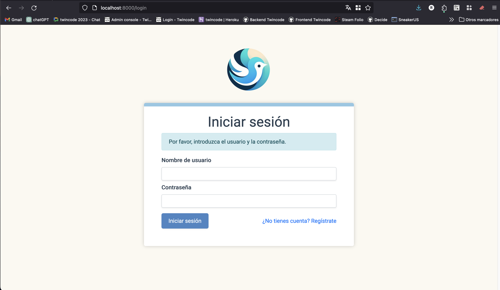
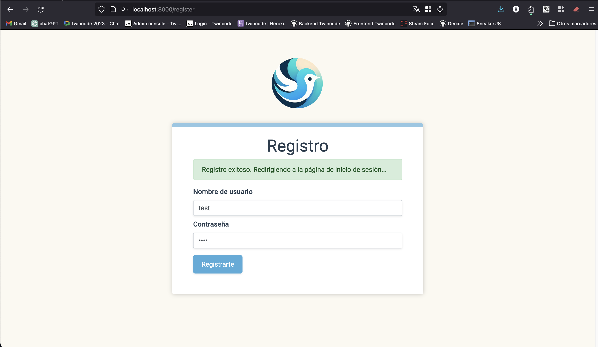
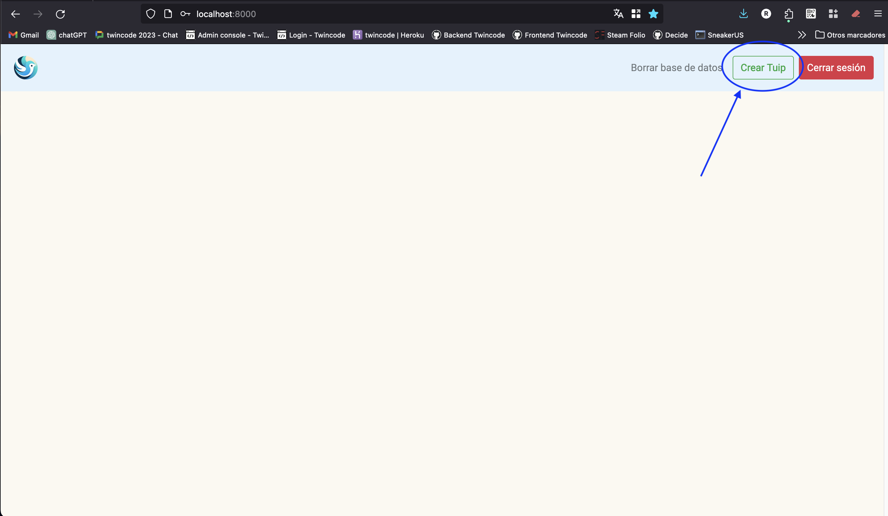
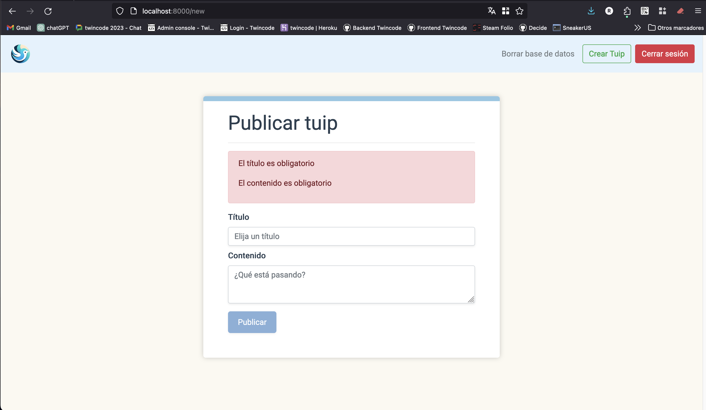
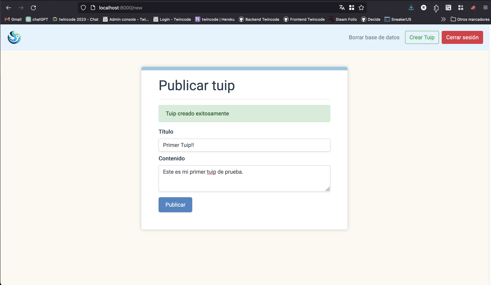
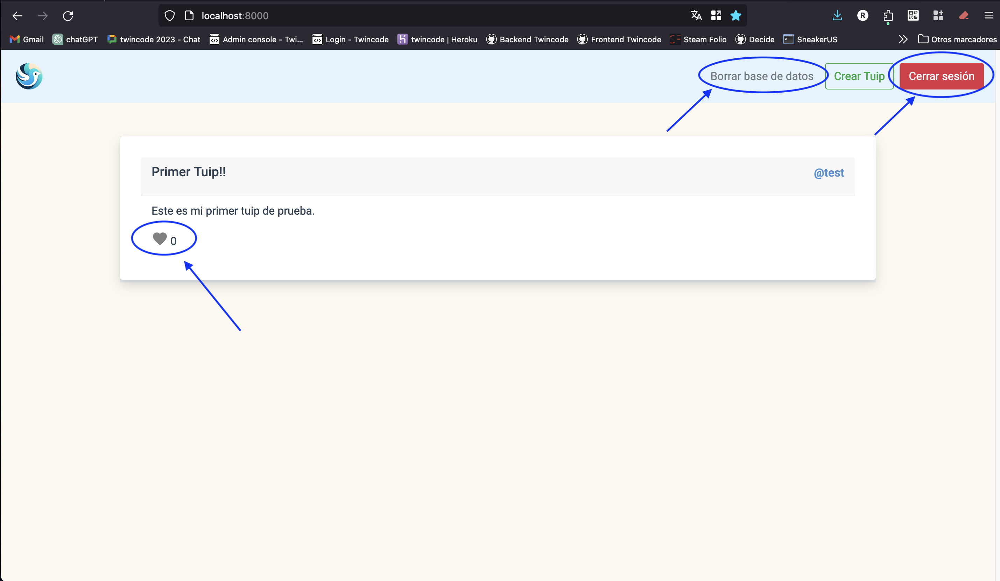
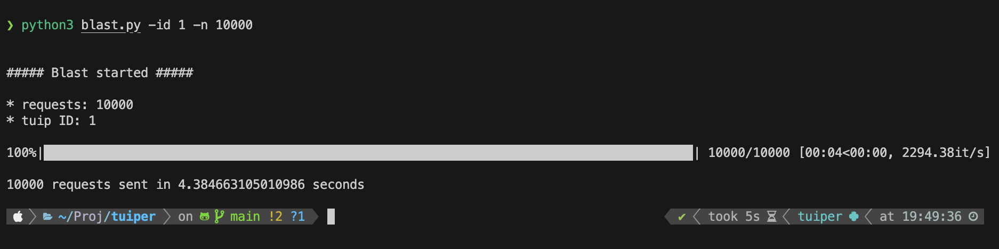
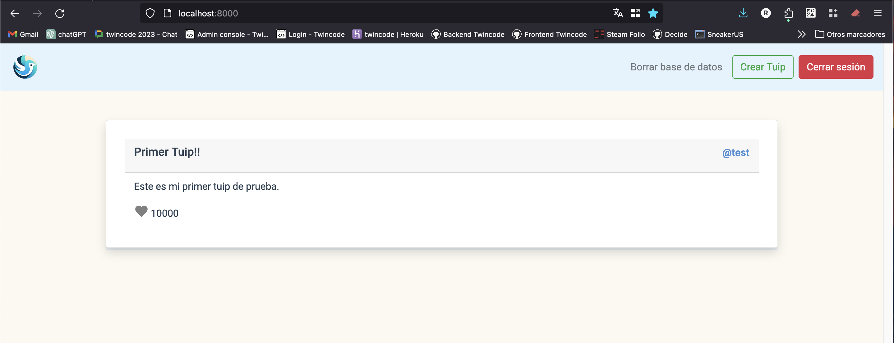

# Tuiper

Tuiper es una aplicación minimalista similar a Twitter, diseñada para probar la concurrencia de escritura en bases de datos. Utiliza Redis como base de datos y Flask como framework web.

## Tabla de contenidos

- [Características](#características)
- [Tecnologías utilizadas](#tecnologías-utilizadas)
- [Cómo ejecutar la aplicación](#cómo-ejecutar-la-aplicación)
  - [Requisitos previos](#requisitos-previos)
  - [Instalación](#instalación)
- [Siguientes pasos](#siguientes-pasos)
- [Pruebas de concurrencia](#pruebas-de-concurrencia)
- [Contribuciones](#contribuciones)
- [Licencia](#licencia)

## Características

- Registro y autenticación de usuarios.
- Publicación de "tuips" (equivalentes a los tweets de Twitter).
- Los usuarios pueden dar "like" a los tuips.
- Pruebas de concurrencia para evaluar el rendimiento de la base de datos.

## Tecnologías utilizadas

- [Redis](https://redis.io/): Base de datos en memoria, utilizada para almacenar los tuips y los likes.
- [Python](https://www.python.org/): Lenguaje de programación utilizado para desarrollar la aplicación.
- [Flask](https://flask.palletsprojects.com/): Framework web ligero para Python, utilizado para crear la API de la aplicación.
- [Gunicorn](https://gunicorn.org/): Servidor HTTP WSGI para Python, utilizado para servir la aplicación en producción. En este caso, se utiliza para simular la alta concurrencia y paralelizar escrituras en la base de datos.
- [Bootstrap](https://getbootstrap.com/): Framework de diseño web, utilizado para crear la interfaz de usuario de la aplicación.
- [Vue.js](https://vuejs.org/): Framework de JavaScript, utilizado para crear la interfaz de usuario de la aplicación.
- [asyncio](https://docs.python.org/3/library/asyncio.html): Módulo de Python que proporciona una infraestructura para escribir código concurrente utilizando la sintaxis async/await.
- [aiohttp](https://docs.aiohttp.org/en/stable/): Cliente y servidor HTTP asíncrono para Python, utilizado para realizar peticiones HTTP asíncronas en la aplicación.

## Cómo ejecutar la aplicación

### Requisitos previos

- Python 3.x o superior.
- Redis instalado y ejecutándose en el puerto por defecto (6379). Se puede usar Docker para ejecutar Redis con el siguiente comando:

```bash
docker run -p 6379:6379 -d redis
```

### Instalación

1. Clona el repositorio:

```bash
git clone https://github.com/rafgoncas1/tuiper.git
```

2. Crea un entorno virtual e instala las dependencias:

```bash
cd tuiper
python -m venv tuiper-env
source tuiper-env/bin/activate
pip install -r requirements.txt
```

3. Configura las variables de entorno:

```bash
cp .flaskenv.example .flaskenv
nano .flaskenv
```

4. Inicia la aplicación con gunicorn (solo sistemas Unix):

```bash
gunicorn -w 4 -k gevent -b 0.0.0.0:8000 app:app
```

## Siguientes pasos

- Accede a la aplicación en tu navegador web en la dirección `http://localhost:8000`.

- Regístrate como nuevo usuario.

- Inicia sesión y le redirigirá a la página principal. Desde aquí podrá ir a crear tuips.

- Cree un tuip y podrá verlo en la página principal.


- Finalmente podrá ver su tuip en la página principal, dar like y ver los likes que publiquen otros usuarios. También podrá cerrar sesión o eliminar la base de datos.


## Pruebas de concurrencia

La aplicación incluye un script de Python para probar la concurrencia de escritura en la base de datos. El script realiza peticiones HTTP asíncronas para crear tuips y dar likes a los tuips existentes. Para ejecutar el script, sigue estos pasos:

1. Abre una nueva terminal y activa el entorno virtual:

```bash
source tuiper-env/bin/activate
```

2. Ejecuta el script de pruebas de concurrencia, modificando el id del tuip (Si hay solo uno creado el id será 1) y el número de peticiones según sea necesario:

```bash
python blast.py -id 1 -n 10000
```
3. El script enviará 10000 peticiones para dar like al tuip con id 1. Se visualizará una barrra de progreso en la terminal y cuando finalice se mostrará el tiempo total de ejecución.



4. Puedes comprobar el número de likes del tuip en la página principal de la aplicación y verificar que se han añadido correctamente, esto indica que la base de datos es capaz de manejar la concurrencia de escritura.


## Contribuciones

Las contribuciones son bienvenidas. Por favor, abre un issue para discutir lo que te gustaría cambiar.

## Licencia

[MIT](https://choosealicense.com/licenses/mit/)

